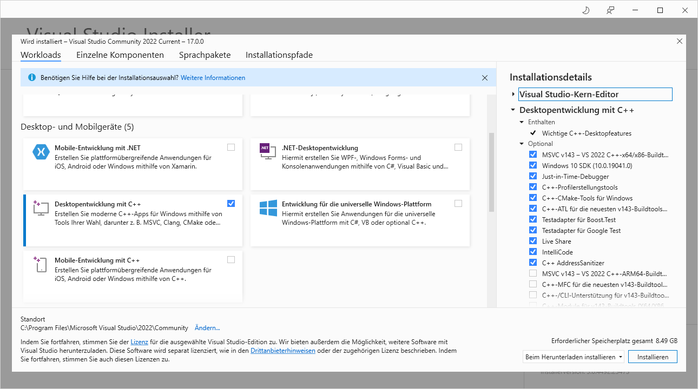

# Proton Probe

This repository contains the implementation of the C++ task that I completed for a Proton Technologies AG interview.

## The task

The task has to be completed in 3 days. The Proton provided description is the following

> Design and implement a generic job system in C++. The system should allow submitting multiple types of jobs, which are placed in a queue. Multiple worker threads consume the queue and run the jobs to completion. Jobs can be cancelled.
> 
> Implementation notes:
> 
>  * The system should be implemented as a single multi-threaded process (the queue should be thread-safe)
>  * The system should accept multiple types of jobs
>  * Should use the classes for multi-threading and concurrency from the C++11 standard library
>  * Jobs should be retried a specified number of times in case of failure
>  * Record basic stats (success, start, and end timestamps, retries, etc.) for completed tasks
>  * The code should be platform independent (though Visual Studio or Xcode can be used for the solution, it should compile and run correctly on multiple platforms)
>  * The solution should use CMake/Ninja for configuration and building
> 
> Bonus points:
> 
>  * Use modern C++ features (C++17) where appropriate and useful
>  * Implement job priorities
>  * Offer the ability to pause running jobs by splitting jobs into multiple subtasks/chunks
>  * Implement possible dependencies between jobs

Because I had only less than a weekend for the implementation, I could not consult Proton about the unclear points but I had to make the decisions myself. You can read them here:

 * *"Design and implement a generic job system in C++."* : The *"system"* will be a static library.
 * *"Jobs can be cancelled."* : The cancellation will be graceful. The tasks are asked to stop their work, they are not forcefully interrupted.
 * *"The system should be implemented as a single multi-threaded process"* : The provided test application is the *"process"*.
 * *"The system should accept multiple types of jobs" : The "multiple types"* are implemented through inheritance.
 * *"Jobs should be retried a specified number of times in case of failure"* : The *"specified number"* is not a parameter for the caller but a predefined number.
 * *"Record basic stats (success, start, and end timestamps, retries, etc.)"* : The *"Recording"* is done through a monitor interface. The interface functions are called for these basic events. Whoever will implement this monitor interface can add time information at the calls, log the events to a file, display them on a screen, forward them to a log service, etc.
 * *"The code should be platform independent (though Visual Studio or Xcode can be used for the solution, it should compile and run correctly on multiple platforms)"* : At the time of implementation, I did not have other platform than Windows available for testing. However, I was not planning to use anything special that would cause issues.
 * *"The solution should use CMake/Ninja for configuration and building"* : I am using Visual Studio 2022 Current for developmennt. Its native CMake project uses Ninja. Unfortunately, I did not have time to investigate the builds on other platforms topic further.

## Setup

The project can be compiled without any IDE as a standard CMake project. In this chapter I am describing the environment that I used to implement the application.

On a freshly installed (and fully updated) Windows 10 machine I installed Visual Studio 2022 Community edition. You can download it from the Microsoft [website](https://visualstudio.microsoft.com/vs/community/). I installed it with the default options (although not everything is required):



After installing it, open the downloaded git repository with the ```Open a local folder``` option. Select the ```job_scheduler_test.exe``` target, press ```Ctrl + Shift + B```, wait until the compilation finishes, and then ```F5```. The test application will lunch automatically.

## Review

The best place to start the review is the test file: [src/test/test_job_scheduler.cpp](./src/test/test_job_scheduler.cpp)

## License

MIT License

Copyright (c) 2021 Gabor Meszaros

Permission is hereby granted, free of charge, to any person obtaining a copy
of this software and associated documentation files (the "Software"), to deal
in the Software without restriction, including without limitation the rights
to use, copy, modify, merge, publish, distribute, sublicense, and/or sell
copies of the Software, and to permit persons to whom the Software is
furnished to do so, subject to the following conditions:

The above copyright notice and this permission notice shall be included in all
copies or substantial portions of the Software.

THE SOFTWARE IS PROVIDED "AS IS", WITHOUT WARRANTY OF ANY KIND, EXPRESS OR
IMPLIED, INCLUDING BUT NOT LIMITED TO THE WARRANTIES OF MERCHANTABILITY,
FITNESS FOR A PARTICULAR PURPOSE AND NONINFRINGEMENT. IN NO EVENT SHALL THE
AUTHORS OR COPYRIGHT HOLDERS BE LIABLE FOR ANY CLAIM, DAMAGES OR OTHER
LIABILITY, WHETHER IN AN ACTION OF CONTRACT, TORT OR OTHERWISE, ARISING FROM,
OUT OF OR IN CONNECTION WITH THE SOFTWARE OR THE USE OR OTHER DEALINGS IN THE
SOFTWARE.